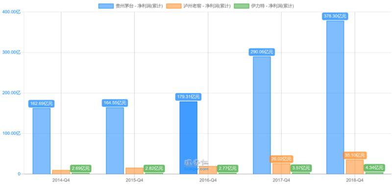
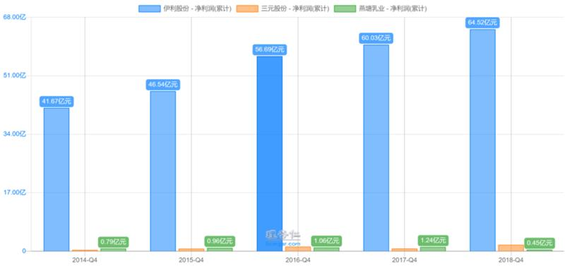
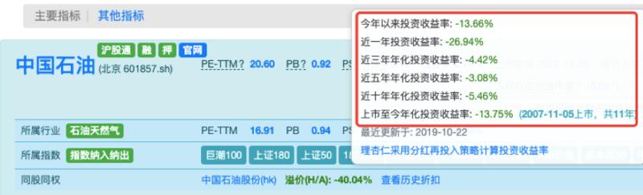
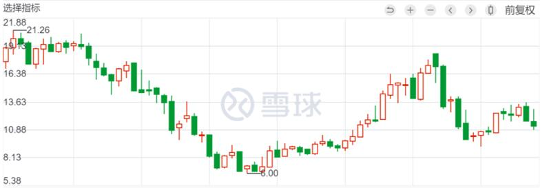

# 好公司

上节的内容中，我们讲完了呆萌选股法当中的“好行业”。
我们先来简单的回顾一下之前的内容。

好行业，是我们呆萌选股法的第一步。
甄选好行业的两个标准，分别是“需求”和“竞争”。

我们会根据“需求”和“竞争”，来给一个行业打分。

满分5分。
只有超过3分的行业，才被我们视为是好行业。

简单的提一下上节课的作业：
电视机行业是好行业吗？

我的答案是：
电视机行业不是好行业，我只能给它打1-2颗星。

它的需求和竞争态势，分别是：
稳定需求/衰退需求+高烈度竞争

随着个人电脑、IPAD、手机等设备的逐渐普及，电视机已经不再是家家户户的必需品。

很多年轻一代，使用移动设备，就可以达到娱乐和获取信息的目的。

所以，电视机的需求，最多是稳定态势，甚至是衰退态势。

另外，电视机行业也没有龙头老大。
就算是海信、海尔、小米、创维等大品牌，在商场里也是疯狂打价格战。没有哪一家的品牌和质量，明显比别家好。

所以，电视机的竞争，是高烈度竞争。

结合需求和竞争。
我给电视机行业的评分，是1-2星。

好，简单的复习之后，就要开始今天的新内容了。

找到好的行业，是一个开始。

找到了一个好行业，是不是就在这个行业里随便挑一个公司买呢？
如果不是的话，那挑选哪个公司呢？

这就是接下来的内容要解决的问题。

从这节开始，我们将正式进入“好公司”章节。

## ---01---

如果我问你，当家教一个月能赚多少钱。
你觉得下面哪个答案是正确的呢？

A.2000-5000元
B.5000-10000元
C.10000元以上

正确答案是：

每一个答案，都是对的。

大学生辅导小学生作业，工资水平是2000-5000元。

高中老师辅导高考内容，工资水平是5000-10000元。

专业培训机构一对一辅导小语种，工资水平是10000元以上。

所以，同样是家教。

辅导对象不同，辅导内容不同，薪资也是不一样的。

为什么要说这个呢？

前面我们说了好行业。

男怕入错行，好行业为从业者提供了优秀的环境和机遇。

但是，如果大家环境都相同时，就到了拼天赋和努力的时候了。

刚才我们看到了。

同样是家教，有的家教只能赚一两千，有的家教能赚一两万。

在投资中，也是一样的。

即便同一个行业，不同的公司，盈利能力差异也是巨大的。

有的一年能赚几百亿，有的一年只能赚几个亿。

我们可以看几个简单的例子感受一下。

先看白酒行业。

贵州茅台，和泸州老窖，都是白酒行业，而且都是高端白酒的公司。

大家猜猜，他们的差距有多大？

如果以股价涨幅来看。
十年前，你投资十万块在泸州老窖，现在会变成40万。
而投在贵州茅台上，现在则是120万。

两者相差3倍。

如果以业绩规模来看。
泸州老窖一年赚40亿。
而茅台一年赚超过400亿。

两者相差10倍。

无论是股价涨幅，还是业绩规模。
泸州老窖跟茅台的差距，都非常大。

而且，泸州老窖怎么说也是大公司。
如果你拿个其他同行，更是没得比。

比如，新疆的白酒公司“伊力特”。
去年的净利润只有3-4亿，是茅台的1%。

如果是看市值的话，茅台一万多亿，伊力特只有几十亿，连茅台的零头的零头的零头都不到……

（图1，“茅台-泸州老窖-伊力特”的净利润对比）

再说一个别的行业，乳制品。

里面最强的公司伊利，相比北京的三元股份，和广州的燕塘乳业，利润规模相差几十上百倍。

（图2，“伊利-三元-燕塘乳业”的净利润对比图）

如果是股价层面。

伊利近10年，涨了约20倍。
燕塘乳业上市时间比较短，最近四年涨了约50%。
三元股份，十年里竟然还亏了10%！

所以，即便是同一个行业。
不同的公司，收益率差别是巨大的。

只有找到好公司。
买入后才能安心持有，放心睡觉。

那什么样儿的公司是好公司呢？
又如何找到好公司呢？

## ---02---

在回答这个问题之前，我先问问大家。
你觉得什么样的公司才是好公司呢？

有的蜜豆可能会说：
公司么，当然是越大越好。
所以，世界500强的公司，总归是好公司咯？

真的是这样吗？

我们来看看中国那些最有名的500强公司。
比如中国石油、中国石化、工商银行、中国移动……

其实这些公司的股票，回报率都很差，业绩也不好。

（图3，投资中国石油的股票，上市至今基本一直亏损）

还有的蜜豆可能会说：
好公司，那应该是和我们的生活息息相关的公司吧，衣食住行这样。

我们来看看这个说法对不对。

首先，中国的餐饮行业，就没有出过牛股，服装行业更是不行。

饮料行业倒是有一些。
但像最大的公司统一、康师傅，最终都没落了。

（图4，统一的股价，6、7年没涨了）

（图5，康师傅的股价更惨，6年了股价不但没涨，还腰斩）

既不是世界500强的大公司，又不是跟我们衣食住行相关的接地气的公司。

好公司，到底是什么样儿的呢？

我们先忘掉那些花里胡哨的，什么规模、竞争优势等等，回到事物的本质来思考。

我们买股票是为了什么？
当然是为了赚钱。

怎么才能赚钱呢？
当然是未来的股价比现在高，我们能够低买高卖。

那要想股价变高，公司是要越来越好，还是越来越坏？
当然是越来越好。

到这里，答案就出来了。

对我们来说，好公司的定义就是：
公司未来越来越赚钱。

价值投资当中，有一句话，叫做：
买股票，就是买公司的未来。

原则上，一只股票过去怎么样，发生了什么，和我们一点关系没有。
就像茅台，过去十年涨了十几倍，你又没买，和你有什么关系吗？

一只股票，就是从我们开始关注它、开始买入它之后，才和我们有关系。

正如一句矫情话说的：
你的过去我不曾参与，你的未来我奉陪到底。

所以，好公司最核心的问题就是：
这个公司未来会更赚钱吗？

---03---
那么，如何判断一家公司未来会越来越好呢？

除了刚才的那个问题外，再加上另外两个前置问题，一共三个问题，就是好公司的判断核心：

1、公司过去的盈利能力强吗？
2、公司过去的盈利质量高吗？
3、公司未来可以赚更多钱吗？

有的蜜豆可能会问：
师兄，你刚才不是说只看未来，过去没意义吗？
怎么前两个问题还是看过去呢？

我且问你。

你在学校里，有见过那种之前学习不认真、不擅长、迟到逃课打架的坏学生，之后幡然醒悟，开始逆袭的情况吗？

另外，你有见过那种之前就品学兼优，很擅长学习的优等生，持续优秀的情况吗？

这两种情况，哪种情况多一些呢？

不知道大家的经历如何。
以我的经历来说，后者的情况，要明显比前者多。
也就是优等生，持续优秀的情况更多。

所以，我们的三个问题也是同理。

那些过去表现差劲、没有竞争力、没有诚信的公司，你指望他有一天幡然醒悟，开始变好。
这是很难指望，也很难判断的。

相反，那些原本就优秀、诚信的好公司，未来继续优秀、高标准的可能性大一些。

简单来说。
我们就是要找那些过去优秀，未来也能持续保持优秀的公司。

---end---
总结一下。

今天，我们先通过同行工资的不同，来和大家说明：
在环境和机遇一样的情况下，个体的努力与天赋，就变得格外重要。

好行业，和好公司，缺一不可。

好公司的判断维度，主要看三个问题。
1、公司过去的盈利能力强吗？
2、公司过去的盈利质量高吗？
3、公司未来可以赚更多钱吗？

其中，第三个问题是核心，买股票就是买未来。
前两个问题是为了第三个问题服务的。

三个判断维度已经知道了，那具体的判断方法是什么呢？
 这个，我们放到下节再来讲吧。

下节课，我们先来说说，如何找到一家股市中的当前优等生。也就是三个判断维度的前2个问题。

今天的小作业：

你所在的行业，工资差异大么？
你觉得你所在的公司，是好公司么？

那我们下周二再见咯。