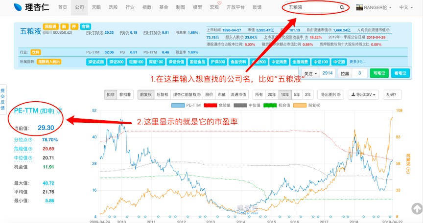

 # 市盈率 PE

今天，我们要讲一个价值投资中，最常用，也最有用的指标。

不少蜜豆可能猜到了。

没错，它就是“市盈率”，又被称为PE。

市盈率，对于我们投资股票能够赚钱，

就像是“加减乘除”，对于“数学”一样重要。

可以说，如果搞懂了“市盈率”，在投资股票这件事上，就很容易赚钱了。

新蜜豆可以一定要认真学习。

老蜜豆虽然学过了，但也不是说就不用学了。

很多老蜜豆虽然知道市盈率是什么，但对市盈率是有不少误解的。

相信看完了今天的文章，老蜜豆们对市盈率也会有新的理解。

好，那我们就正式开始今天的内容吧。

---

某人才招聘市场上，

铁柱、小花、二狗，这三位童鞋等待我们的宠幸和包养。 

他们今年刚刚大学毕业，踏上了自己的工作岗位。

简单的介绍一下他们：

铁柱：哈佛大学毕业的金融分析师，年薪50万，未来很可能成为巴菲特的顾问。

小花：某互联网公司老板助理，年薪20万。未来有希望当上公司的高管。

二狗：农民工小哥，天天去工地搬砖，年薪5万。对人生有些迷茫，不知道如何才能赚到更多钱。

很容易看出，这三位童鞋的价值是不同的。

所以，如果要包养他们，让他们来为我们打工赚钱。

包养所付出的钱，肯定也完全不同。

就拿现在一年赚50万的铁柱来说。

未来如果成为了巴菲特的顾问，那年薪百万甚至千万都是有可能的。

因此，可能要花2000万，才能包养到铁柱。

那么小花呢？

一年赚20万的小花，未来可能成为高管。

但普通互联网公司的高管肯定没有巴菲特顾问的待遇那么高，有个几十万就已经很不错了。

所以，花500万，差不多就可以包养到小花了。

最后是在工地上搬砖的二狗。

如果不好好跟师兄学习，二狗可能一辈子就只能在工地上搬砖了。

因此，花50万，差不多就可以包养二狗了。

---分割线---

在上面的故事里，我们发现。
包养铁柱，我们花的钱是他目前收入的40倍。
（铁柱目前的收入是50万一年，但要花2000万才能包养他。所以2000除以50，就等于40）

那么，如果铁柱是一家上市公司，他的市盈率就是40，或者说他的市盈率就是40倍。
（PE为40，和40倍PE，这两种说法是一样的）

同理，我们也可以算出来，小花和二狗的市盈率。
小花的市盈率等于500万除以年薪20万，等于25倍。
二狗的市盈率等于50万除以年薪5万，等于10倍。

市盈率代表了我们投资者对公司的看法。
越好的公司，市盈率一般就会越高。

道理很简单，因为公司赚的钱很可能会越来越多，前景也会越来越好。

比如铁柱今年赚50万，明年可能就赚100万了，5年后可能就能成为巴菲特的助理了。
对于这样的铁柱，花2000万来包养，好像就不是那么贵了。

---分割线---

那么，在哪里可以看到一家公司的PE呢？

理杏仁、i问财，或者其他一些网站上都可以查到的。

拿理杏仁来说，输入股票名称后，就可以查看它的市盈率啦。

（见附图，PE-TTM（扣非）是市盈率中最常用的一种，新手小白直接看这个就可以了）

到这里，蜜豆们，尤其是老蜜豆们请注意。
前方高能预警！

不少蜜豆在之前学习“市盈率”的概念时，是用“回本年限”的说法来理解它的。
所以，有不少小伙伴会觉得说，既然“市盈率”代表的是“回本年限”，那不是越低越好吗？那为什么好公司的市盈率都比较高呢？

重点来了：
请蜜豆们忘掉“回本年限”的说法。

**市盈率，实际上它代表着市场上其他投资者，对于这只股票的看法。**

市盈率越高，说明市场先生越看好它。

比如现在的“贵州茅台”，市盈率高达30多倍。说明市场觉得它很有前景，很能赚钱。

相反，市盈率越低，说明市场先生越不看好它。

比如现在的“海澜之家”，市盈率只有12倍。说明市场觉得它前途迷茫，赚不到钱。

那么到底是高市盈率的贵州茅台能为我们赚钱，还是低市盈率的海澜之家能为我们赚钱呢？

其实，从它们两个身上，我们都是可以赚到钱的。

关键在于，我们是不是能够搞清楚“贵州茅台”和“海澜之家”，它们的合理市盈率分别是多少。

如果能在合理市盈率以下买入的话，我们大概率就可以赚钱了。

---

到这里，有蜜豆肯定要问了：

什么是合理市盈率？

怎么判断一家公司的合理市盈率呢？

怎么利用市盈率，来给公司估值？

心急吃不了热豆腐哈。

蜜豆们先消化一下今天的内容，

关于合理市盈率，我们下一节再来讲。

