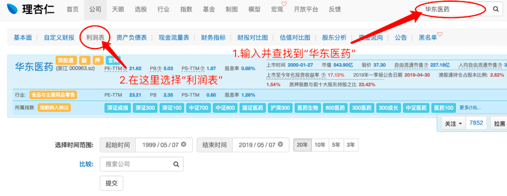

 

# 利润增速

又到了每周二的干货内容了。
上周我们讲了“合理市盈率”，蜜豆们可以从下方链接来回顾这个知识点：

文章最后我们留了一个小作业：
你认为“伊利股份”的合理市盈率是多少？

这里公布一下我自己的答案：
“伊利股份”合理市盈率A和B的取值，分别是25和27。
所以，最后我给“伊利股份”的合理市盈率，是25倍。

当然，投资没有标准答案。
如果你比较保守，给23倍、甚至20倍，也都是可以的。

---

有不少蜜豆，看到自己关注或者买入的公司交上“年报成绩单”的时候，都对“利润增速”感到非常疑惑。

**利润增速，是年报中最重要的指标之一。**

它也是我们能否从股票中赚到大钱的决定性因素。

那么，利润增速多少算高？多少算低？怎样是OK的？
今天我们就来聊聊这个话题。

首先，还是请我们的老朋友“铁柱，小花，二狗”登场。
今天，他们化身成为了高中的同班同学。

铁柱同学，本来在班里默默无闻。

最近，由于天天在家喝老妈煲的人参汤，考试成绩突飞猛进。

原本只能考60分的铁柱，最近几次考试接连考了70分、80分，最后考到了90分。

小花同学，一直是班里的优等生，下课时间都在学习。
考试成绩基本保持在80分以上，心情好时也能考到90分以上。

二狗同学，脑袋瓜还算灵光。
打球，撩妹样样精通，但就是不把时间花在学习上。
用功的时候，能考90分；
贪玩的时候，只能考60分。

---

上市公司每年都会给我们教一份“成绩单”，告诉我们它今年赚了多少钱，以及比去年多赚了（或少赚了）多少钱。

赚了多少钱，也就是公司的净利润，它就像是三位同学的考试成绩。

那么，利润增速，它就像是考试成绩的变化情况。

它反映的是，

这次赚到的钱，比起上次，多了多少（或少了多少）。

打个比方，利润增速是20%的话，就代表了今年的“净利润”比去年的“净利润”，多了20%。
如果“利润增速”是负数，则代表减少了相应的比例。

我们可以根据利润增速，把上市公司分为三种类型。

· 突飞猛进型
猛如吃了人参的铁柱。
典型特征：利润增速连续三年超过20%。
（坊间称为“高速增长”）
栗子：华东医药。

· 四平八稳型
稳如优等生的小花。
典型特征：利润增速连续3年为正，但不足20%。
（坊间称为“低速增长”）
栗子：伊利股份。

· 过山车型
皮如打球撩妹的二狗
典型特征：三年内利润增速出现过负数。
（坊间称为“增长停滞”）
栗子：青岛啤酒。

在哪里可以看到一家公司的“利润增速”呢？
指标类的东西，我们看理杏仁就对了。

我们以“华东医药”为栗。

在“理杏仁”中找到“华东医药”，并打开“利润表”。
（见图1）

然后在利润表中，找到“归属于母公司普通股股东的扣除非经常性损益的净利润”一项。

后面出现的数字中，带有百分比的数字，就是每一年公司的“利润增速”了。
（见图2）

比如华东医药，2016-2018年的“利润增速”，就分别是：32.49%、23.32%、28.51%，所以它属于“突飞猛进型”。

---分割线---

师兄，我学会按照“利润增速”，给股票归类了。
那是不是利润增速越快的股票，就越好呢？

这个问题，我们留到下周再来讲，蜜豆们可以自己先思考一下。

一点小提示：

**股票市值 = 净利润 ✖️ 市盈率。**

最后再给大家留一个小作业：

找一家你熟悉的公司，用今天师兄讲的“利润增速归类法”，判断它属于哪种类型。

听说经常写作业的蜜豆，都能赚大钱~

作业在留言区评论即可，记得交作业哟。