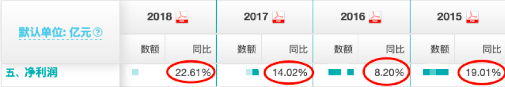
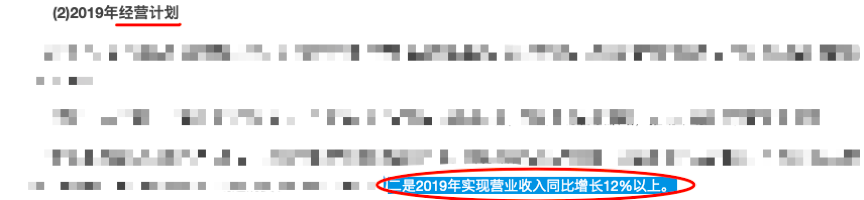
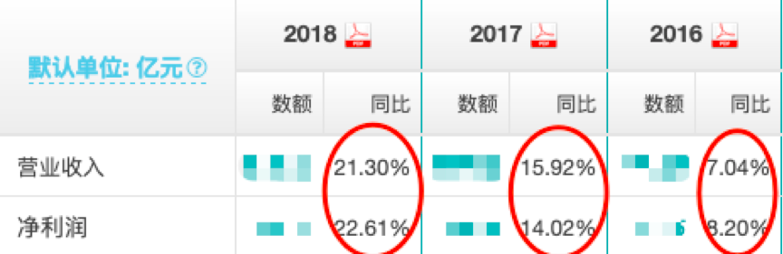

#预期收益率03

上周，我们讲了预期收益率N的其中两个要素：
X和Z的取值方法。

课后留了一个小作业给大家：
计算伊利股份的X值和Z值。

我们一起来简单的计算一下：

以7月16号伊利股份的数据为例。

首先是Z。
**伊利股份的股息率是2.13%，分红率常年稳定在50%以上。**
**那我们的Z就直接取2.13%，没有问题。**

然后是X。
伊利股份，之前我们讲过属于黄金小队。
但它在行业中并不是完完全全的霸主，行业中还有蒙牛这样强有力的竞争对手。

结合它的PE中位数，这里合理市盈率，我们可以取25。
（对合理市盈率怎么取还不了解的同学，可以在精华帖第一篇中的相关文章复习一下）

伊利股份的当前市盈率，我们直接在理杏仁上可以查到，是29.59，近似30。

这里，由于伊利每年都有比较固定的政府补贴，所以看“非扣非”的PE-TTM就可以了。

当然，你保守一点，取“扣非”的PE-TTM也没什么问题，计算结果不会有太大的误差。

接下来就是计算X值。

先用合理市盈率，除以当前市盈率。
也就是25除以30，得到0.83。
再用0.83开三次方，得到0.94。
最后用0.94减去1，得到-0.06。

X的取值，就是-0.06，也就是-6%。

当然，比较保守的同学，X算出来是-7%，-8%，甚至是-10%，都没有大问题。

复习就到这里。
接下来，就要开始我们今天的内容了，也是N的三个要素中，最麻烦的：
净利润增速Y的取值。

---

如果说X和Z的取值，是科学的计算。
那么Y的取值，就是艺术的估算。

为什么这么说呢？
因为没有人能准确的知道一家公司未来的利润增速。

当你对一家公司越了解，
你取的Y也就相对越准确。

那有的蜜豆就要问了：
师兄，那如果不了解公司，是不是Y就只能靠猜了？

猜？猜你个头。
拍脑门的行为，滚粗！
靠猜得来的Y，只会误导你对N的计算。

所以说了半天，不懂分析公司的学渣，是算不了Y了吗？
那我前面学的那些N,X,Z不都白学了吗？…

嗯，虽然我们说给Y取值，需要了解公司。
但退而求其次，还是有两个比较初级的方法，可以辅助我们大致判断。

1）	寻找那些历史上增长比较稳定的公司，放弃业绩增长不稳定的公司。

历史上利润增速比较稳定的公司，它未来的利润增速也会相对稳定。这样，我们对于它未来的利润增速预估，也就多了一些把握。

拿“铁柱股份”来说：
最近几年，公司的净利润基本保持着每年10-20%的稳定增长，所以过往的利润增速有一定的参考价值。

所以这里“铁柱股份”的Y，我们可以在10%-20%里取。

2）	看看上市公司的老板，自己是怎么说的。
参考老板的说法，再加上一定的安全边际。

对于“信誉比较好”的公司，我们可以参考在年报中，他们对自己下一年的业绩预期是多少。

比如，在铁柱股份2018年的年报中，管理层对2019年的目标做出了营业收入同比增长12%的规划。

 近几年，铁柱股份的营收增速与净利润增速几乎相同。

所以，我们可以近似的认为管理层对利润增速的预期就是12%。

综合以上两个方法，我们对铁柱股份的利润增速Y，保守就可以取10%，乐观一点就可以取15%。

---

上一篇当中，我们已经算出了铁柱股份的X是10%，Z是2.48%。
那到这里，我们就可以把铁柱股份的N“组装”起来了。

保守的情况，Y取10%，则：
N=(1+X)*(1+Y)+Z-1
=（1+10%）*（1+10%）+2.48%-1
=23.48%

可以看到，铁柱股份的N 超过了20%，可能是一个好机会。

最后，还是要再次强调一下。
这种给Y取值的方法，仅仅作为入门的初级方法。

想要更精确、更有把握的给Y取值，了解公司是必不可少的。

今天的小作业：
根据你对“伊利股份”的了解，你给它的Y取值多少呢？
伊利股份最终的N，你又得到的是多少呢？

记得在评论区交作业哟~

---分割线---

预期收益率的上中下三篇，到这里就全部结束了。

总结一下：

N对我们投资有很大的指导意义。

它能够帮我们分辨出一笔投资的优劣。

以及提醒我们什么时候该上车，什么时候该下车。

有的豆粉可能会说：
师兄，那看来投资也没那么难嘛。
只要算算小学数学题，比较一下大小，就知道该买还是该卖了。

这里的关键，就在于：
投资不是单纯的数学题。

只有当你足够了解一家公司之后，你计算的N，才会变得有意义。脱离了公司经营的任何数据和计算，都是没有“灵魂”的。

而且计算N，

不会减少股市的波动，

也不能确保你每年的收益。

所以，在股市中锻炼心态，也是投资的必修课。

希望蜜豆们能够用知识和心态武装自己，戒骄戒躁。

最后让时间，来给我们满意的答案~