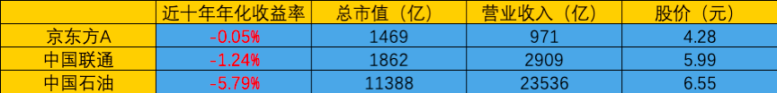
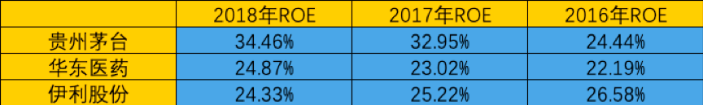

# 净资产收益率 ROE

上一节，我们讲完了预期收益率N。
通过计算N，我们能够大致判断出手里的股票够不够便宜，有没有投资价值。

**但“好价格”，还得建立在“好公司”上。**

毕竟，9块9包邮的地摊货，
虽然便宜，但质量可是很坑人的。

所以，撇开质量来谈价格，显然是没有意义的。

那怎么才能知道一家公司是不是好公司呢？
这就是我们今天要来解开的谜题~

---

要弄明白这个问题，我们就先来看看，
好公司和烂公司的差距是什么。

我们先来看一组好公司。
既然是好公司，当然股价也应该涨的好~

投资这些好公司，在过去的十年里，
年化收益率都在25%-30%左右。

这意味着10年前你投入1万块，
现在能得到10万-13万左右，本金翻了10倍多！

看完好公司，我们再来看一组辣鸡公司。
烂公司，当然股价也跌的惨。

投资这些烂公司，意味着你会亏很多钱。

就拿中国石油来说，别看年化收益率只有-5%。

但在“复利”的作用下，

10年前你投入的1万块，现在就会只剩5000块了，几乎损失了一半的本金。

别说跑赢通货膨胀，能剩条内裤就不错了…

那好公司和烂公司的差距到底在哪呢？
我们回到两张图中的数据上来。

是好公司的市值更大吗？
好像不对。

“中国石油”的市值比“华东医药”大了几十倍，但收益率却完全被碾压。

那是好公司的营业收入更高吗？
好像也不对。

好公司小组中的每一个成员，
营业收入都比烂公司小组的要低。

难道是好公司的股价更高？看上去好像挺有道理的…
有，有你个头啊！知识它真的不进脑子啊！

师兄，你就别卖关子了！快告诉我到底是啥吧！

嗯，有一个万金油的指标，可以给我们指明方向。
所有赚钱的好公司，都在这个指标上表现惊人的一致。

这个指标，就叫做“净资产收益率”，简称“ROE”。

我们来看看好公司组，和烂公司组的ROE表现吧。

图3

图4

可以很明显的看出：
**好公司组的ROE数值，常年碾压烂公司组。**

那这个ROE到底代表了什么？
它为什么又是判断好公司的重要标准呢？

---

**ROE，它代表的是一家公司的盈利能力。**

**它等于公司今年赚取的净利润，除以公司的净资产。**

` 也就是：ROE = 净利润 / 净资产 `

*（所谓净资产，就是指从公司所有的资产里，扣除欠别人的钱，剩下的属于自己的那部分资产）*

**ROE越大，代表公司每一分钱的投入，能够赚到的钱更多。**

这么说可能不够具体，我们来举个栗子：

铁柱最近开了一家大型百货公司。

首先他要造楼，然后是装修、布线。

这前前后后，花了铁柱1个亿，百货商场才正式竣工。

开业后，商家纷纷入驻。

每年扣去必要的物业费、水电费等费用后，铁柱能够净赚1000万。

同一时间，小花开了一家馄饨店。

小花先租了一个店铺，然后买擀面杖，砧板，锅等器具，以及客人坐的桌子椅子，最后还有店铺的装修。

这些开店前必要的准备，总共花了小花10万块钱。

馄饨店营业后，
每年扣去房租、水电费、员工工资等，小花能净赚10万。

对比铁柱的商场，和小花的馄饨铺。
我们发现，虽然铁柱的商场更大，每年赚到的钱也比小花多的多。

但其实，小花馄饨铺相比铁柱商场，“资本利用率”更高。

为什么呢？
因为铁柱是投资了1个亿，每年才赚到1000万的。
铁柱要花10年，才能把投入的本金赚回来。

这里，铁柱商场的ROE，就是10%。
（用净利润1000万，除以净资产1亿）

但小花只投资了10万块，每年就能赚到10万。
小花只要一年的时间，就可以把投入的本金赚回来。

这里，小花馄饨店的ROE，就是100%。
（用净利润10万，除以净资产10万）

如果你是金主爸爸，
你是更愿意花1个亿，把铁柱的商场买下来呢？
还是更愿意花10万块，把小花的馄饨铺买下来呢？

相信聪明的蜜豆，都会选择买下小花的混沌铺。
所以从投资的角度来说，小花的混沌铺就比铁柱的商场要好。

---

讲到这里，肯定有蜜豆要问。

师兄，
那好公司的ROE标准是什么？
烂公司的ROE又是什么呢？

心急吃不了热豆腐，
同学们先消化一下今天的内容，理解ROE的含义。

这些问题，我们下周来讲。

今天的小作业：
假设狗剩花了100万元，开了一家游戏制作公司。
其中有20万，是狗剩问铁柱和小花借来的钱，都是要还的。

如果狗剩靠卖游戏，今年净赚了8万块。
那么，公司今年的ROE是多少呢？

记得交作业哟
