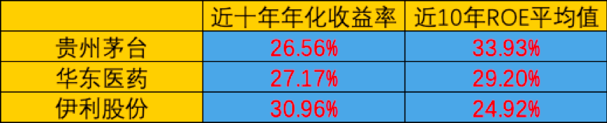
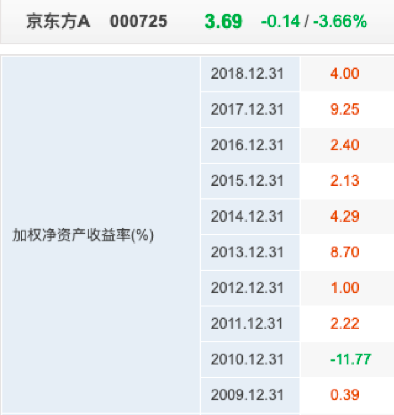
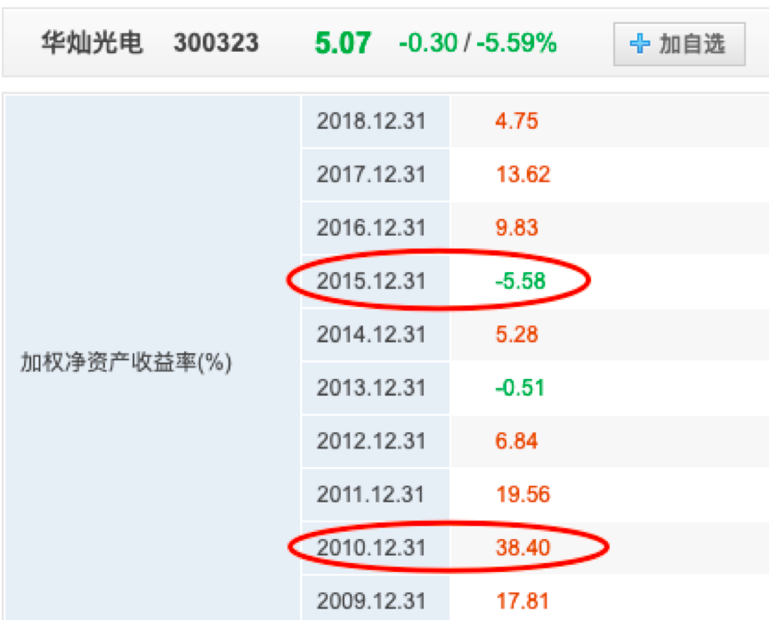
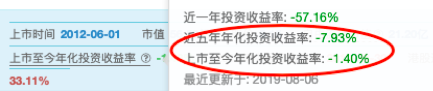

# 净资产收益率 ROE-02

上周，我们讲了ROE的含义：
**ROE代表了一家公司的盈利能力。**

一家公司的ROE越高，
代表了它每用1块钱，能够赚到越多的钱。

课后我们留了一个小作业：
狗剩游戏公司的ROE是多少呢？

答案应该是：10%。

我们先用100万元的总资产，减去20万的欠款，得到净资产是80万元。

然后，再用净赚的8万，也就是净利润，除以净资产80万元，得到ROE为10%。

算出80%和8%的数学鬼才们，
小学数学老师找你们回去谈谈心……

好了，复习完之后，就要开始我们今天的内容了。

上一节当中，我们讲到ROE是判断好公司的标准之一。
高ROE的公司，长期也能带给我们高回报。

那到底高ROE的标准是什么？
ROE长成什么样的公司，又是我们不该碰的呢？

---

我们首先来回答第一个问题：

**好公司ROE的标准是什么？**

要回答这个问题，我们不妨先参考一下股神巴菲特的意见。

巴老爷子在去年的股东大会上，
曾经表示正在考虑A股市场的投资机会。

当记者问到巴老爷子具体会投资什么公司时。
巴菲特回答说：

**我们会考虑那些净资产收益率大于20%，长期稳定增长的股票。**

敲黑板，划重点了：
股神明确告诉我们，ROE长期大于20%的公司，才是他认为潜在的好公司。

那么，这个长期到底是多长呢？
关于这一点，股神没有给出具体的说法。

但投资里说的“长期”，肯定不止是两三年。
因此，我们不妨以10年的角度来看。

在i问财上可以查到连续10年ROE大于20%的公司，目前一共有10家。

但股神说的，也只是一个模糊的正确，并不是严格的门槛。

比如，19%的ROE算不算高呢？
当然也算。

再比如，连续9年ROE大于20%算不算长呢？
当然也算。

所以，如果一家公司大致能够接近这样的标准，就算是一个好公司的苗子了，我们可以选择重点关注它。

---

然后是第二个问题，ROE长成什么样的公司，我们不该碰呢？
有两种ROE“长相”的公司，我们应该尽量远离：

- 1）	ROE常年不到10%的。

通过之前表格中，一些好公司的ROE和投资回报率的对比。我们知道长期来看，ROE和投资回报率非常接近。

那如果一家公司的ROE常年不到10%，
也就意味着我们在它身上能赚到的年化收益率，不到10%。

这样的股票，显然是股票界的耻辱，没什么吸引力。

比如在上一节当中，我们提到过的“京东方 A”。
它最近10年的ROE，没有一年是到过10%的。

所以，如果你10年前投资了它，至今仍然还是亏钱的。

图3

图4

- 2）	ROE上蹿下跳，不稳定的。

ROE不稳定，也就代表着公司的盈利能力不稳定。

这类股票，不仅容易出现暴涨暴跌，
而且投资的回报率也非常不稳定，
是我们建议新手蜜豆们避开的“周期股”。

比如之前有蜜豆问到过的“华灿光电”。
它最近10年的ROE就是“上蹿下跳”型的。
高的时候有38%，低的时候只有-5%。

这样的公司，长期来看，也很难赚到钱。

图3

图4

---

通过一家公司历年的ROE表现，
我们就大致能够判断一家公司是不是好公司的苗子。

一家公司的ROE，与我们长期的投资收益息息相关。

所以，我们在选择股票的时候，要尽量选择能够持续稳定保持高ROE的公司。而不要选择ROE不稳定，甚至ROE常年不到10%的公司。

最后，还是要提醒蜜豆们。
高ROE，并不代表公司一定是好公司。

它只是作为好公司的初选，仍然需要我们进一步来分析。
毕竟，公司未来能不能持续的赚钱才是关键。

今天的小作业：
根据股神巴菲特的选股标准，连续10年ROE>20%的公司，目前在我们中国市场都有哪些呢？

记得要动手写作业哟。