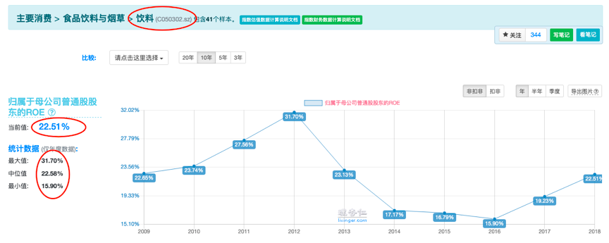
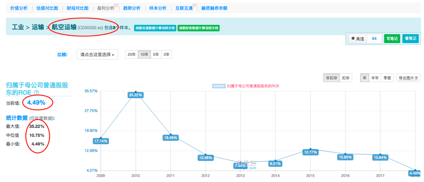

# 三好选股法

在茅台酒厂里，“外皮”发现了公司一些比较重要的特点：

   - 作为购买方议价能力强
   - 作为供应商议价能力强
   - 新进者难以构成威胁
   - 同行竞争弱
   - 几乎没有替代品

这五个方面的特点，又被称为“波特五力模型”。
它是我们用来甄选好公司的一套重要的方法。

最后留给大家一个思考题，不少蜜豆也答的不错。
但更多的蜜豆表示：

师兄，我一看都懂，一自己分析就全程懵逼。
这还有救吗？

好，从今天开始，我们就把“波特五力模型”拆散揉碎，一条一条的来给大家梳理一遍。

一家公司的经营流程，一般包括采购原材料，加工生产，卖出产品获利，与其他公司的产品展开竞争。

那我们今天，就从最开始的采购原材料开始说起吧。
也就是波特五力模型当中的“购买者的议价能力”。

瓜子板凳准备好了吗？
那我们现在就开始吧~

---

所谓购买者的议价能力。
简单的说，就是它的上游敢不敢杀它的价。

购买者议价能力强的公司，对上游的话语权就强。
也就是我们经常说的：客大欺主。

购买者议价能力比较强的，典型的就是白酒行业。

我们知道，白酒最重要的原材料，就是“高粱”、“大米”或者“玉米”等谷物原材料。

这些谷物，都是农民从庄稼地里种出来的，而且也不是只有某一户农民在生产。就算是茅台所用的当地特产“红缨子高粱”也不例外。

显然，这些农民，面对像茅台、五粮液这样的大酒厂来说，丝毫没有什么话语权。

什么？你家高粱涨价？
不好意思，我们去隔壁老王家里收高粱去了。

所以，对于白酒行业来说：
它的原材料主要是谷物，而谷物非常普通，没有什么特殊性，生产它的人也特别多。

因此，白酒行业的“购买者议价能力”就很强。

---

没有对比，就没有伤害。
说完了“购买者议价能力”很强的白酒行业，我们再来看一个反面案例：航空业。

航空业，可以说在“购买者议价能力”这方面，弱到了极致。

一家航空公司，需要先从飞机制造厂商手里买下飞机。
其次，是涂上自家的油漆，给飞机装饰一下。
最后是加好油，赚旅客的飞机票钱，以及运货的运费。

所以，航空公司的原材料是什么呢？
最主要的，就是飞机，和石油。

首先来说飞机。

飞机制造商，那可不是种高粱的农民。
国内几乎所有的飞机，都来自于两家飞机制造商：
“空客“和“波音”。

这两家飞机制造商生产的飞机，占国内所有客机的比例，接近95%。

换句话说，航空公司的上游，基本被“空客”和“波音”两家公司垄断了。

所以，即使对于“东方航空”这样的大型公司来说，面对“空客”和“波音”公司，也没有什么太大的话语权。

什么？
你嫌“空客”的飞机太贵，又觉得“波音”的飞机太耗油？

没问题，你可以选择隔壁老王自主研发的“拖拉机”。
据说老王本人都不敢乘坐。

其次，就是石油。

中国的石油，也基本上是被两个老大哥垄断了：
“中国石油”和“中国石化”。

航空公司想要给自己的飞机添加燃料，自然也就只能看这两个老大哥的脸色。

什么？
嫌我们家石油太贵？
那你可以拿家里的“金龙鱼”，倒在飞机里试试…

---

通过“白酒业”和“航空业”的对比。
我们可以看出两个行业，在“购买者议价能力”上的巨大差距。

这种差距，最后也会反应到整个行业的盈利能力，也就是ROE的大小上。

图1

图2

通过对比“白酒业”和“航空业”，我们也可以总结出影响“购买者议价能力”的两个重要因素：

· 上游供应商是否为分散的小公司
· 上游供应商的产品是否有差别

如果一家公司，它上游的原材料供应商，在行业内都是分散的小公司（比如卖高粱的农民）。或者它上游卖的产品同质化严重，整个行业的产品都没什么太大差别（比如普通的谷物）。

那么，这家公司的“购买者议价能力”就会比较强。

反之。
如果一家公司，它上游的原材料供应商，在行业内是垄断的大公司（比如中国石油）。或者它卖的产品具有特殊性，别家没有（比如飞机）。

那么，这家公司的“购买者议价能力”就会比较弱。

对于我们投资者来说，那当然是希望自己挑选的公司，“购买者议价能力”比较强了。

最后，想要判断一家公司“购买者议价能力”的强弱，最最重要的，当然是：
你得先了解这家公司的上游到底是谁。

这也是我们经常说的，投资一家公司，必须先了解它到底是卖什么的，怎么卖的原因。

今日互动：
“购买者议价能力”的强弱，你会判断了吗？
根据今天所学的知识，你觉得“白色家电”行业的“购买者议价能力”强弱如何呢？
（白色家电一般指空调、洗衣机、电冰箱等家用电器，典型的公司如“格力电器”、“美的集团”等）

记得在评论区交作业哟~