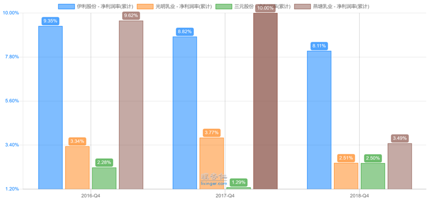

# 好公司

上节的内容中，我们讲完了呆萌选股法当中，“好公司”的第一个部分。

通过比较同一个行业，不同公司的境遇。
我们知道了：
在环境和机遇一样的情况下，个体的努力与天赋，是格外重要的。

最后，我们说到了判断好公司的三个标准。
具体怎么来判断，就是接下来我们要解决的问题了。

---

开始之前，我先问你一个问题：
你觉得自己跟王撕葱相比，谁更能赚钱？

绝大多数豆粉的第一反应，当然是王老板更赚钱呀！

他爹可是身价千亿的富豪。
王撕葱挥一挥手，一个上亿的项目就开工了。
我们这些穷人……当然只有被秒杀的份儿。

听完今天的内容，或许你会有不同的答案。
还记得上节当中，最后说到的三个判断好公司的问题吗？

没错，它们是：
1、公司过去的盈利能力强吗？
2、公司过去的盈利质量高吗？
3、公司未来可以赚更多钱吗？

标准已经知道了，具体怎么判断呢？

我们一个个来看。
今天先说第一个，“盈利能力”的问题。

---

盈利能力可以通过三个指标来判断，分别是：

1、ROE是否常年较高？
2、毛利率是否较高？
3、净利率是否较高？

一家好公司，往往在这三点上都没有明显的短板。

ROE是什么？
ROE，也叫净资产收益率。

术语有点复杂，我们来举个栗子。

在现实中，判断一个人赚钱能力的指标是什么？

看TA的年薪好像就可以。
赚得多的，就比赚得少的厉害嘛。

比如，王撕葱每天宅家里打游戏、遛狗、睡大觉，一年后赚了1个亿。

你拿着5万块本金创业，开了个小店，一年到头起早贪黑，辛辛苦苦，终于把生意做起来，赚了50万。

所以，王撕葱的赚钱能力，要比你强的多……吗？
显然不对。

相信蜜豆们也注意到了。

你虽然只赚了50万，但你是靠着5万块本金赚来的。
回报率是10倍，也就是1000%。

而王撕葱赚的1个亿，很可能是靠着100亿的银行存款，吃利息得来的，回报率只有1%。

从这个角度看，你应该比王撕葱的赚钱能力，强得多。

没错。
判断一个人的赚钱能力，不应该看年薪，而应该看“回报率”。

在投资中，这个“回报率”就是ROE。
比如你花1万块钱，在一年的时间里赚到5000块。
那么回报率，即ROE就是50%。

ROE体现了你利用资本的能力，这个值越高越好。

像中石油，一年虽然能赚300亿，看起来很大一笔钱吧。但他的ROE连2%都不到。

为什么呢？
因为它动用的本金高达1万多亿。

所以，单独看一家公司净利润的大小，也就是公司的“年薪”，是无法判断一家公司真实赚钱能力的。

因为利润高，可能是因为调动了大量的资本。
比如王撕葱用100亿存银行，也能一年赚1亿。

相反，看ROE，才是一个更精确公正的指标。

ROE怎么看？

可以在“理杏仁”网站上看到。（<a class="link-of-topic" href="https://www.lixinger.com/" title="理杏仁 — 独立思考、理性投资" target="_blank">理杏仁 — 独立思考、理性投资</a>）

以“贵州茅台”为例。

我们先搜索到“贵州茅台”。
然后先点击“财务指标”，再找到‘归属于母公司普通股股东的ROE’，这个就是我们说的ROE了。

图1

图 2

那ROE多高算高，多低算低呢？

根据经验。
10%，可以算是一个及格线；
15%，算是良好；
20%，那就是优秀了。

当然，越高越好，多多益善。
不过，能常年保持20%以上ROE的公司，是凤毛麟角。

到这里，ROE的用法也就出来了：
1、如果一家公司过去5年ROE都能保持在15%或以上水平，我们认为其盈利能力不错；
2、如果一家公司的ROE，能常年比自己的竞争对手高一截，那我们可以考虑，其是否具备独特的竞争力，是一家好公司。

---

判断一家公司的盈利能力如何。
除了ROE，还有一对孪生兄弟，它们是：
毛利率，净利率。

这俩也是很重要的指标。

我们假设一下，你做乳制品生意，一年卖酸奶收入是100万。
那么，你这年是赚到了100万吗？

肯定不是，对吧。
因为你还得付出成本，买原材料。

酸奶不是凭空做出来的。
采购原奶、配料，招聘生产线工人，买包装盒打包装等等。这些为了生产酸奶所必须要付出的成本，一共要花掉60万。

那现在，你就剩下40万了，这就是你的毛利润。
毛利润40万，除以收入的100万，得到40%，就是毛利率。

所以，你一年可以赚到40万吗？

想得美！
刚才说的40万，只是毛利润。

酸奶造好以后，你还得租店铺卖酸奶吧？
还得店铺店租、做广告牌、请售货小妹吧？
为了管账，可能还要请个兼职会计帮你做账吧？
最后的最后，你还得交所得税呀，纳税光荣嘛。

以上这些全部扣除完，七七八八算下来。
真正到你手上的……大概是8万块。
这8万，就叫做净利润。

8万净利润除以100万收入，得到8%，就是你的净利率。

辛苦半天，其实你卖100万的酸奶，最终才只能赚8万块……

如果同样卖100万的酸奶。
铁柱的厂子，扣除原材料成本后，只剩30万；
扣除所有的成本后，只赚5万块。

那是你的厂子更赚钱，还是铁柱的厂子更赚钱呢？
显然是你更赚钱，对吧。

所以，毛利率和净利率就可以用来衡量企业的盈利能力。

那为什么不同的公司，毛利率和净利率会有差距呢。

就拿你的酸奶厂，和铁柱的酸奶厂来说吧。
主要原因可能有两个：
1、你的酸奶厂，酸奶的价格卖的更高。
2、你的酸奶厂，原材料成本可能更低。

前者代表了你的酸奶厂，产品可能更优秀、更高端，或者有品牌溢价；
后者代表了你的酸奶厂，对成本控制更加优秀，经营效率更高。

无论是哪一点，都显示你的酸奶厂是一家更好的公司。

净利率也是同理，净利率越高越好。
净利率高的公司，除了毛利率更高之外，还可能是因为其他费用，如打广告花的销售费用、管理费用更加少。

花出去的少了，到我们股东手的自然就多了。

因此。
毛利率和净利率越高，说明公司的竞争优势可能越强。

那么，具体怎么判断呢？

没有严格具体的标准。
以我个人的经验：

1.如果一家公司的毛利率在30%以下，净利率在5%。
这往往代表其产品与别人同质化严重，没有差异化，大家都利润微薄没什么钱赚。
（所谓同质化，就是大家东西都一样，没什么品牌、性能、用户情感上的差异性。）

2.如果公司的毛利率能在30-50%，净利率能在10%左右。
这代表其产品具备一定的差异性，企业也有一些利润，但不会特别多。

3.如果公司的毛利率在50%以上，净利率在20%以上。
这代表产品具备很大的差异性，利润丰厚。

标准明白了，接下来是具体怎么看。

看毛利率和净利率，方法和看ROE是一样的。
在理杏仁同一个页面往下拉就是。
（见图3）

---

口说无凭，我们来看几个例子。

既然举到了乳制品的例子，我们就以牛奶公司为例。
猜猜看，牛奶公司的毛利率是多少？

我们看数据。
（见图4）

图4是四个中国A股的牛奶公司。

行业老大伊利股份，老三光明乳业，以及区域性的乳企三元股份和燕塘乳业。

它们的毛利率介于32-37%左右。
所以，每卖100块牛奶，它们只能拿到1/3的毛利润。
另外60多块，都用来采购原奶、包装、生产设备了。

而且其中我们看到，伊利的毛利率最高，比它的竞争对手高4-6%。

再猜一下，奶厂们的净利率有多少？

答案是：

2018年，几家公司的净利率是2.5%-8%不等。
最高的伊利也只有8%。
（见图5）

其中，光明和三元，净利率都是2.5%。
按照这个标准，一瓶售价3块钱的奶，光明只能赚0.075元，也就是7分钱。

伊利的净利率是8%。
看起来，比其他人也好不到哪里去。

但8%，是2.5%的三倍多。

我们要思考的是，在竞争激烈的情况下，为什么伊利能比别人多挤出5-6个点的净利润呢？

这可能是其产品售价更高，或者他产品结构中，高端产品比别人更多一些。

具体什么原因，我们后面再去分析。
但不管怎么说，我们现在发现，伊利的盈利能力，是比其他人高的。

除了毛利率和净利率。
别忘了，还有一个重要的指标。

没错，就是ROE。
这个指标是一个更综合，更核心的指标。

我们来看一下。
（见图6）

表里显示，伊利最近几年ROE都在25%的水平。
而其他厂商，则每况愈下，2018年沦落到5%不到。

简单地可以理解为，投资到伊利的每100元资本中，每一年可以产生25元左右的回报。

而另外几家，只有3-5块，也就只比存银行好一些。

这么一看，伊利是真的很强啊。
难怪过去十年涨了那么多。

---

好了，通过三个指标，我们对伊利和几个乳制品公司，形成了初步的印象。

虽然还有很多问题没有解决。
但我们知道了，伊利的盈利能力比对手高了一大截。
在好公司这点上，它比其他人好得多。

今天的内容就到这里了。
接下来，总结一下今天的内容。

我们说了判断好公司的第一个问题：
公司过去的盈利能力如何。

回答这个问题，主要有三个维度：
ROE、毛利率，和净利率。

这三个指标，都是越高越好。
一家公司在这三个指标上，越突出，越可能是好公司。

当然，我们还说了查看这些指标的操作方法。

最后，我们就留个小作业吧：
请查看‘贵州茅台’与‘伊力特’的ROE是多少？
这两家都是白酒公司，差别大吗？

学有余力的同学，还可以试着分析他俩毛利率和净利率的区别。

师兄的小提示：

投资是一个技能，除了知识，练习也很重要！
那些以为只要看看文章就能学会人，就跟以为只要把男神女神照片设置为屏保、挂墙头就能和男神睡觉的人一样……

想多了！

还有，记得好好做笔记噢。
学投资 ≠ 看偶像剧，看完合上电脑就完事。

PS：
下节，我们来说我的一个朋友的故事，他年入百万，省吃俭用，竟然还穷的叮当响？！
