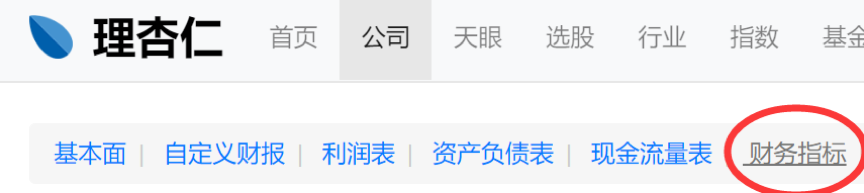
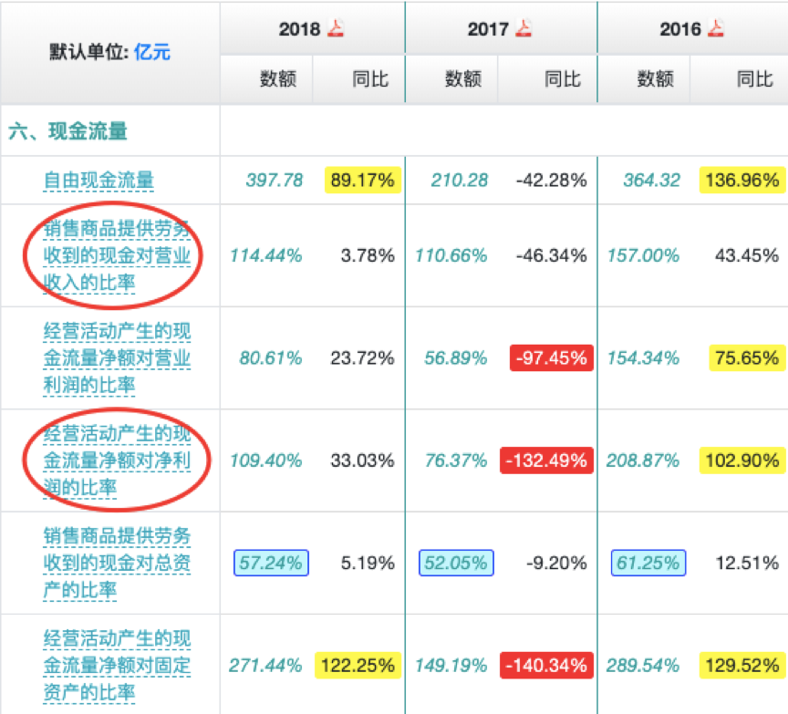

# 好公司03

上节的内容中，我们讲完了呆萌选股法中，“好公司”的第二部分。

现在，我们知道了。
判断一家公司的盈利能力，可以从ROE、毛利率、净利率这三个指标上来观察。

之后，我们分别讲了这三个指标所代表的含义，以及它们的用法。

简单的回顾一下上节课的作业：
“贵州茅台”和“伊力特”这两家白酒公司的ROE是多少？差别大吗？

我们可以在理杏仁上查询到这两家公司近年的ROE。

结果显示：
贵州茅台的ROE大部分时候都在30%以上。
而伊力特的ROE大部分时候仅在15%左右。

虽然15%，放在别的行业也还算不错。

但作为白酒公司，
伊力特与贵州茅台的差距，显然是巨大的。

好，复习就到这里。

在开始今天的内容前，同学们可以先回忆一下。
判断好公司的三个问题是什么呢？

没错，它们是：

1、公司过去的盈利能力是否够强；
2、公司过去的盈利质量是否够好；
3、公司未来是否可以继续变好。

“盈利能力”，上节讲完了。
今天，我们就来重点讲讲第二个问题，也就是“盈利质量”。

### ---01---

话说，铁柱前几年开始创业。

因为人比较聪明，运气也还算不错。
几年下来，事业蒸蒸日上。
今年一年的年收入，已经能达到200万左右了。

这个收入，应该很不错吧？

起初我也这么认为。
不过最近，他跟我诉说自己的惨状：
银行卡里1万块都拿不出来，过年的钱都是问朋友借的。

我感到有些吃惊。
一年赚200万，怎么过年的钱都没有呢？
难道是被人骗了？

后来我才知道，原来他的这200万，是“纸面富贵”。

什么意思呢？

虽然铁柱号称一年有200万利润。
但因为他是给政府做项目。
活儿虽然干完了，但是钱要等好久才能收回来。

所以，他空有利润，但没有现金。

就好比农民工兄弟，辛辛苦苦打工搬砖一年。
虽然当初承诺的工资还不错，但到了年底却讨薪难。

这种空有账面利润，但并没有收到真金白银的情况，就被叫做“纸面富贵”。

在投资中，“纸面富贵”代表的就是一家公司，盈利质量很差。

### ---02---

那如何判断一家公司盈利质量的好坏呢？

有两个基础的指标，分别叫：

销售收现率，和经营现金比。

这两个比值都是越大越好。

越大，代表盈利质量越高；
越小，代表盈利质量差。

一家盈利质量好的公司，也就更可能是好公司。

销售收现率，经营现金比。
这两个词儿听起来很专业，不好理解。

我们来举个例子，说明一下。

假设你自己创业开了一家奶茶店，一杯奶茶卖10块钱。
忙活一天以后，你卖了100杯奶茶，每杯都是一手交钱一手交货。

请问你这天的收入是多少？

计算很简单：
10x100 = 1000块。

由于都是一手交钱一手交货。
所以你也确实收到了1000元现金。

OK。

买奶茶的收入是1000，也确实是收到了1000元现金，那么你的“销售收现率”就是1。

它等于“销售商品收到的现金”，除以“营业收入”。

销售收现率等于1，代表每一块钱的收入，都确实收到了1块钱现金。
（这个现金，术语叫“销售商品、提供劳务收到的现金”）

那么，“销售收现率”有可能不是1吗？
有的。

现在假设，生意不好做。
你为了招揽客户，允许大家赊账。

今天你卖出去100杯奶茶，收入是1000元。
但有50杯都是赊账，没给钱。

那么你收到了多少钱？

因为有50杯没收，那就是只收到另外50杯的钱。
也就是：
50x10 = 500块。

所以，此时销售收现率就是：
500/1000 = 0.5。

没错，因为大家的赊账。
每1块钱营收，实际只收到了0.5元的现金。

如果你是老板，你喜欢销售收现率是1，还是喜欢是0.5呢？

相信蜜豆们都会选择“销售收现率”是1。
毕竟，不给赊账，钱都赚到自己腰包里当然更好呀。

不过，1不是最爽的，大于1才是最爽的。

销售收现率还可以大于1吗？
答案是肯定的。

假设你的奶茶特别受欢迎，生意特别好。
顾客纷纷抢着买你的奶茶。

于是你决定搞会员充值业务。
在你这里充值办卡的人，可以优先购买到你的奶茶。

客人可能充了100元的卡，但是暂时只买了一杯10块的奶茶。

这时，这位顾客带来的营业收入是多少呢？
因为你只卖了一杯奶茶，所以收入是10元。

但因为会员卡充值，你收到了100块的钱。
这就会造成收到的钱，比收入多的情况。

此时，销售收现比是多少呢？
没错，用“实际收到的现金”100元，除以“营业收入”10元。

即：
100/10=10

说完理论后，我们用两家实际的公司来看看。

安防监控行业（就是做各街口和小区的摄像头）有两家大公司，分别叫海康威视，和大华股份。

我们看一下两家公司销售收现率的比较：

可以看到。

海康的销售收现率，三年来一直在100%-104%的水平。
而大华则只有85%-91%，两者差了一大截。

所以，海康的盈利质量更高。

### ---03---
说完了第一个，销售收现率。
我们再说第二个，经营现金比。

经营现金比的思路很类似，也是两个数的比值。

不同的是。
销售收现比，是用“收到的现金”，除以“营业收入”。
经营现金比，则是用“经营活动产生的现金净额”，除以“净利润”。

这个值，也是越接近1，或者大于1越好。
越接近0，甚至小于0，则代表越糟糕。

怎么理解呢？
我们还是举个例子。

假设你今天卖了一天的奶茶。
一共卖出100杯，都是一手交钱一手交货。

那么，营业收入和实际收到的现金，都是1000元。
销售收现率也就是1。

但这1000元，只是营业收入。
你的奶茶还有原料成本、店租，以及给员工发的工资。

原料成本200块，店租300块，员工工资200块。
这些七七八八扣除，你只有300块的利润了。
（1000-200-300-200 = 300块）

假设原料、店租、工资都是一天一付。
你今天手上多了多少现金呢？

没错，应该也是300元。
这些成本，都是你从1000块钱的现金里，当天付出去的。

所以忙活一天。
你的净利润是300块，手上也确实多了300块现金。

我们就说你的“经营现金比”是1。
用“经营活动产生的现金流量净额”300元，除以“净利润”300元得到。

假设情况现在有变。
房东说跟你说：
不行，明天的房租你不能结束了再给，你今天就得先预付我100块。

于是你又付了100块给房东。
你手上的现金，就变成了只剩200块了。 

那么，经营现金比就变成了：
200/300 = 0.67。

如果，这时候。
奶、糖和珍珠的原料商人也坐地起价，说最近物资短缺，紧俏得很，你得先付明天的钱我才能发货给你。

你又付出去200块购买这些原料。
那你手上，就一分不剩了……

你忙活了半天，手上没有多1毛钱现金。
经营现金比是多少？

当然就是0了。

作为老板，你喜欢经营现金比是1，还是0呢？
当然是1，对吧？
毕竟，钱留在自己身边，总比先给别人好。

所以，经营现金比越大的公司，盈利质量也就越好，越值得我们关注。

经营现金比越大，不仅说明公司可以支配的钱越多。
它还表明，公司在产业链当中话语权越强（供货商和客户不敢漫天要价），这都是竞争力的体现。

理论说完了，我们继续来看实际的例子。

还是以海康和大华为例：

海康的“经营现金比”为80%水平，没有达到100%。

但对比看，大华只有30%的水平，相差不只一点半点。

这说明海康的盈利质量更好，话语权更强。

### ---04---

最后，“销售收现率”和“经营现金比”，需要自己动手计算吗？

都9012年了，这些数据当然都不需要我们手算。
它们都可以在理杏仁网站的“财务指标”模块上查找到。
（见图3）

图4

好了，我们总结一下今天的内容。

今天我们回答了第二个问题：

**公司过去的盈利质量是否够好。**

这个问题，可以用两个指标来检查：

**1、	销售收现率。**
**它是“销售商品提供劳务收到的现金”对“营业收入”的比率。**

**2、	经营现金比。**
**它是“经营活动产生的现金流量净额”对“净利润”的比率。**

这两个值都是越大越好，越小越差。
值越大，说明公司有越多的钱可供支配，可供发展。

同时，更重要的。
值越大，说明公司在产业中的话语权越强，这是竞争力的体现。

最后留个作业：

根据今天所学知识，你觉得“伊利股份”和“三元股份”的盈利质量如何？
（尝试从“销售收现率”和“经营现金比”这两个数据来判断）

那我们下周二再见咯。