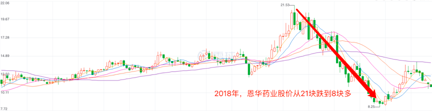

# 利润增速

 

上周我们讲了怎么根据“利润增速”，来给公司分类。

根据利润增速的不同，可以把上市公司分为“突飞猛进型”、“四平八稳型”和“过山车型”。

最后，我们留了一个问题：
利润增速，是不是越快越好呢？

今天的内容，我们就来重点回答一下这个问题。

---

老样子，先说结论：

**利润增速，要结合“市盈率”一起看。**

只有那些利润增速快而稳，市盈率又低于合理市盈率的公司，才有搞头。

上周，师兄给了大家一个小提示：

**股价 = 净利润 ✖️ 市盈率**

我们想要从股票上赚到钱，那就是希望股价上涨嘛。

**那根据这个公式，如果“净利润”和“市盈率”都出现上涨，股价就很有可能一飞冲天。**

但如果“净利润”和“市盈率”，

这两个要素其中一个，或者两个都出现了下降，

那么，股价也就很难上涨了。

我们来看几个具体的栗子。

**1)	市盈率下降，利润增速上升。**

代表：2018年的恩华药业
我们去看恩华药业的“利润增速”，会发现它是突飞猛进型的。

2018年，“恩华药业”的利润增速将近有40%，可以说非常高了。

利润增速这么高的公司，股价应该也涨的很快吧。

我们来看看2018年，恩华药业的股价涨的有多快。

WHAT？利润增速这么快的公司不是好公司吗？
怎么股价跌的这么狠？

答案是：
恩华药业，在2018年的时候，市盈率曾一度高达50倍。

我们之前讲过，合理市盈率不能高于30倍。
所以显然，当时它的市盈率是偏高的。

之后，医药股集体崩盘。

恩华药业就是那个跌的最凶的，

从21块钱，跌到只有8块钱左右。

所以，如果市盈率远高于合理市盈率，那么利润增速再快，也是没有意义的。

**2)	市盈率上升，利润增速下降。**

代表：2018年的鄂武商A

鄂武商A，大部分蜜豆可能不太熟悉。
它是一家开超市和商场的公司，武汉的小伙伴可能听说过。
这家公司，算是湖北地区的零售龙头。

鄂武商A，在2018年下半年的时候，市盈率一度在10倍以下，最低达到过6倍左右。

而且，当时它还是白马股。
6倍PE的白马股，谁不上谁沙雕啊！

嗯，如果当时你上了，真的就沙雕了。

格力电器，伊利股份等白马股，
今年年初，纷纷都从低点涨了超过50%。

而鄂武商A，就只涨了20%不到。
不仅如此，还被踢出了白马股的队列。
（2018年，鄂武商A的ROE不足15%）

到底是什么原因，把这只以前的大白马拉下水了呢？

**答案就是：**

**利润增速。**

鄂武商A的利润增速从2017年的22%，一下变成了-7%。
换句话说，净利润不但没有增长，反而还下降了。

所以，即使鄂武商A的市盈率是低于合理市盈率的。
如果利润增速下滑，甚至变为负数，股价也是难以大幅上涨的。

**3)	市盈率下降，利润增速下降。**

代表：2018年的老板电器。
	
老板电器，之前已经说过很多次了。
它在2018年年初，市盈率高达35倍。
显然，这个市盈率也是不合理的。

之后，跟恩华药业一样，股价大跌。
从53块钱一直跌到了20块钱。

但老板电器，比恩华更惨。

2018年，老板电器的利润增速是-5%，相比2017年的22%出现了大幅下滑。

这种市盈率和利润增速同时下降，造成股价暴跌的惨剧。

坊间称为：戴维斯双杀。

这是我们需要极力避免的情况。

**4)	市盈率上升，利润增速上升。**

代表：2018-2019年的劲嘉股份

2018年年底，劲嘉股份曾经跌到过7块钱，当时的市盈率是17倍左右。

劲嘉股份，之前师兄大致也分析过。

它是属于白银小队的，合理市盈率，大约是20倍。

显然，当时的劲嘉股份，市盈率是低于合理市盈率的。

而劲嘉股份的利润增速，非常快。

2017年，2018年，都超过了20%。

因此，到了今年年初股市回暖后。
市盈率和净利润的双双上升，让劲嘉股份的股价一飞冲天。
坊间称为：戴维斯双击。

这是我们最希望看到的情况。

---

利润增速的内容，到这里就全部讲完啦。

**总结一下：**
**利润增速，要结合市盈率一起来看。**

当市盈率低于合理市盈率时，利润增速高的公司更有搞头哟。

今天的小作业：

看一下你自己手上的股票，有没有市盈率低，利润增速又快的股票呢？

如果有，或者不确定，可以拿出来跟大家分享一下。
如果没有，好好反思一下，是不是平时没有好好刷星球！

作业在评论区留言哟。

---分割线---

下周的干货，我们来重点讲讲股息率。

想知道师兄是怎么通过股息率，在某牛奶公司上赚到钱的吗？

下周二，我们不见不散哟~