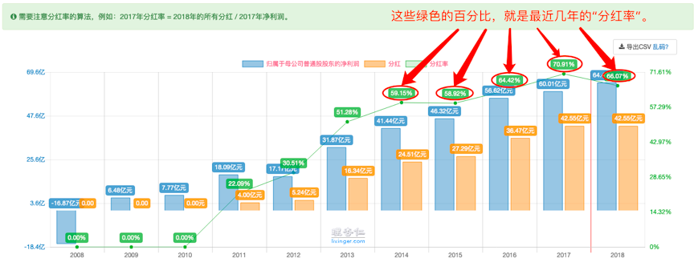

# 股息率&分红率

Hello，蜜豆们好~

又到了每周二的干货内容了。

上周的内容当中，我们讲了“利润增速”。

最后的结论是：

**“利润增速”要结合市盈率来一起看。只有当市盈率低于“合理市盈率”时，利润增速高的公司，才更有搞头。**

讲完了利润增速，我们就要来讲“股票知识体系”当中，另一个非常重要的知识点了。

**它是股票当中最常用的指标之一，也是我们后续神秘选股法的基础。**

它的名字，叫做 **“股息率”**。

师兄曾经靠着它，在某只牛奶股票上赚到了不少钱。

“股息率”到底是什么？该怎么看？

师兄又是怎么用它来赚到钱的呢？

让我们一起进入今天的内容吧。

---

老蜜豆，应该都知道我爱喝酸奶。

以前还在公司上班的时候，

每天早上路过楼下包子铺，都会买一盒酸奶就着包子喝。

酸奶卖的这么好，酸奶公司的股东岂不是赚的很爽？

就这样，生产酸奶的“伊利股份”引起了我的注意。

2014年下半年，

在一个秋高气爽，落叶纷飞，

空气中弥漫着爱情酸臭味的日子里。

我，与“伊利股份”牵手了。
…

对不起，走错片场了。

2014年下半年，

我花了10分钟看了“伊利股份”的财报后，就包养了它。

之后，虽然我跟伊利，经历了“分分合合”。
（太贵了，包养不起的时候，我会卖掉它，换一只更便宜更好的）

但每次分手后，我还是会默默的关注它。
每次喝酸奶的时候，也都会想起它。

去年9月份，伊利妹子又重新引起了我的注意。

无论是业绩，还是估值，
都像是第一次认识它的时候那样优秀。

没错，就是初恋时的那个味儿！

而且，更重要的是。
这一次，它更优秀了，股息率超过了3%。

---

咦，师兄，这个乱入的“股息率”是个啥？
它跟伊利妹子优秀不优秀，有啥关系呢？

我们知道，上市公司每年会把赚到的一部分钱，分给买入它家股票的股东。

这个行为，叫做分红。

打个比方，铁柱用1万块钱，买了“伊利股份”。

到了年底，“伊利股份”分红，分了300块钱给铁柱。

那我们就说，“伊利股份”的股息率是3%。（用分红数额300，除以铁柱买入股票的总市值10000，得到3%）

同样，

二狗用10万块钱，买了“伊利股份”，就会得到3000块的分红。（3000是10万的3%）

小花用1000亿买下整家“伊利股份”，那就会得到全部的分红30亿。（30亿是1000亿的3%）

所以，**股息率，它就等于公司的总分红，除以公司的总市值。**

它反映的是，一家公司的分红数额是不是够高。

3%的股息率，意味着即使公司股价不涨。

光是每年的分红，我们就可以白白拿到3%的收益！

像伊利这样的公司，每年还在不断增长。

假设3年前，我们花10万块钱，买入“伊利股份”的股票。

现在，伊利的股票，不仅值20万，价值翻倍了。

而且，每年的分红，从开始每年分3000块，到现在每年5000块，越来越多。

而如果3年前，你拿10万块，买的是年化3%收益的余额宝。

到现在，不仅本金10万块丝毫没有增长，就连收益率都下降了，每年3000块钱都赚不到。

显然，其中的差距，是巨大的。

去年下半年的时候，伊利的股息率就到达了3%左右。

于是我果断又与它复合。

短短的半年时间里，它又为我赚到了将近50%的收益。

---

看起来，“股息率”是越高越好。

那到底多少算高呢？

一般来说，股息率超过2%的话，股票就比较有吸引力了。

但也不是说，低于2%的公司，就一定不能买。

这里要注意的是，“股息率”要结合“分红率”一起看。

这个“分红率”又是什么呢？

假设“伊利股份”一年赚了100个亿，其中有50亿分给我们股东。

那我们就说，“伊利股份”的分红率是50%。（用分红总额50亿，除以总利润100亿得到）

**分红率表示的是，公司每年赚到的钱，其中有多少是拿出来孝敬我们股东的。**

**只有分红率比较稳定的公司，我们看股息率才有意义。**

这里，肯定有不少蜜豆会问：

师兄，什么叫稳定？什么叫不稳定？

我们还是拿伊利股份来说。

过去5年，伊利股份的分红率分别是：
60%，60%，65%，70%，65%。

像伊利股份这样，连续好几年分红率都在60%左右的，就是稳定的。

当然，不一定非要像伊利股份一样60%的分红率这么高。
能保持40%，甚至30%的分红率，也算是稳定的。

我们再来看一个反面栗子：九州通。

九州通过去5年的分红率是：
0%，30%，0%，13%，14%。

这种一年有，一年没有的，就是不稳定的。
当然，如果每年只有5%，10%这种的，也算是不稳定的。
（都不分红，还谈啥稳定）

---

最后，股息率和分红率去哪里看呢？

我们的老朋友，理杏仁，又该登场了。

（理杏仁：每回都请我出场，给我出场费了咩？）

打开理杏仁网站：

首先是股息率：

搜索并查找你想看的公司，比如“伊利股份”。

在首页的位置，就可以看到“股息率”的数值。

或者，你想看的更全面一点，可以把页面往下拉。
这里可以看到股息率的历史变动情况。
（虽然公司一年可能才分一次红，但因为股票的市值每天都是变化的，所以股息率也会每天都有变化）

然后是分红率：

首先还是搜索并查找你想看的公司，比如“伊利股份”。

然后选择下面的“基本面”，再点选“分红分析”。

之后，页面上就会显示公司近年的分红情况。

这些绿色的百分比数字，代表的就是“分红率”。

---

故事的最后，我与伊利妹子，又暂时分手了…

毕竟，最近它的市盈率超过30倍了，不再吸引我了。

但未来的某一天，也许我会跟它再续前缘。（风险提示：股票的分分合合，请勿在现实的交往中随意模仿。）

爱分红的公司，运气都不会太差。

不爱分红的公司，十有八九都有自己的小九九。

高股息率，且分红稳定的公司，更有吸引力哟。

今天的内容，到这里也就告一段落啦。

快去看看你持有的公司，股息率高不高，分红是不是稳定吧~

那我们就下周再见啦~