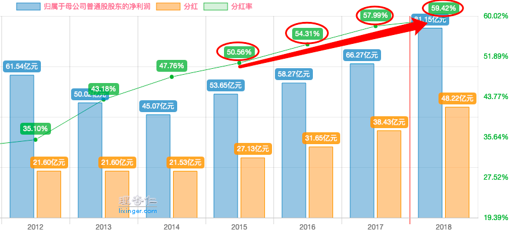
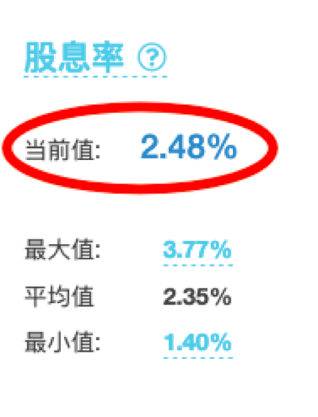

#  预期收益率 02

---

之前我们讲了预期收益率N的概念和计算公式。以及公式内的X,Y,Z分别代表什么。

时间有点长了，不少蜜豆可能对上次的内容有些遗忘了。

因此，在开始今天的内容之前，我们先来简单的复习一下几个重要的知识点。

预期收益率N，代表了我们在一只股票上，预期能够获得的年化收益率有多少，它的高低反应了股票的吸引力。

N怎么计算？

计算N，我们要用到X,Y,Z。
它们分别代表了市盈率增速，利润增速和股息率。

计算公式：

`N=(1+X)*(1+Y)+Z-1`

为什么要这么算呢？
因为我们买股票的收益，来自于两部分：

公司每年的分红，
以及公司市值的增长（也就是股价的上涨）。

每年分红能赚到的收益率，就是股息率Z。

而市值=净利润*市盈率。
因此市值的增长，就是净利润和市盈率增长的叠加。
也就是（1+X）*（1+Y）-1。

所以，我们把这两部分相加，就得到了最后总的预期收益率。
即：N=(1+X)*(1+Y)+Z-1

**N大于20%，代表股票吸引力较高，可以考虑买入。**
**N小于10%，代表股票吸引力较低，可以考虑卖出。**

---

好，复习就到这里。

下面就是我们今天的新内容了：

`X,Y,Z的取值方法。`

师兄将以某上市公司“铁柱股份”为栗，手把手的带大家过一下怎么取X,Y和Z。

---

### 首先，我们先热热身，从最简单的Z开始。

**Z就是股息率**，在“理杏仁”等平台上可以直接查到它。

看起来非常简单粗暴。
但取Z的时候，还是有一个要注意的地方：

**公司的分红必须是稳定的。**
**只有稳定分红的公司，Z的取值才有意义。**

我们来看一下铁柱股份的分红情况：

可以看到“铁柱股份”的分红率节节攀升，最近几年基本稳定在50%-60%之间。

所以我们直接取铁柱股份当前的股息率2.48%作为Z的值，没有问题。

---

### 接下来，就是稍微麻烦一点的X，也就是市盈率增速的取值。

市盈率增速，是指一只股票，从当前市盈率变化到合理市盈率时的变化速度。

我们经常说，市场长期来看是有效的。

这里不仅仅是说，股价最终会向公司的真实价值靠拢。
更是说，市盈率最终会逐渐变化到合理市盈率上。

那么，到底多久算是长期呢？

简单的，我们就以3年为界。

3年的时间，足够市场恢复“理性”，让股票的市盈率，“回归”到合理市盈率上。

知道了当前市盈率，合理市盈率，以及需要的时间。

接下来，就是一道小学数学题了。

以铁柱股份为例。

铁柱股份在行业内算是一家还不错的公司，有一定的竞争力。

综合它的PE中位数，这里我们就假设铁柱股份的合理市盈率是20。（不知道合理市盈率怎么取的，滚回去精华帖第一篇复习…）

铁柱股份当前的滚动市盈率可以在“理杏仁”上直接查到，这里我们假设现在它现在的市盈率是15。

从当前市盈率15变化到合理市盈率20，用时3年。
那么平均每年应该增长多少呢？

小花同学掰着手指头一算：
20减15，增长了5。
5除以15，增长了33%。
3年33%，一年就是11%。
所以X就是11%！

不得不说，小花的数学，确认是体育老师教的。

**市盈率的增长，应该是一个幂指数运算。**（也就是我们常说的“复利”）

每一年应该是在上一年的基础上增长的。

所以这里，正确的计算方法应该是：

    1）先用合理市盈率20，除以当前市盈率15，得到1.33。

    2）把上一步计算的结果1.33，开三次方，得到1.1。
    （不知道怎么开三次方的同学，看一下图3手机计算器的操作步骤）

    3）最后用开方后的结果1.1，减去1，得到X。
    X=1.1-1=0.1=10%

这样，我们就得到了正确的市盈率增速X为10%。

也就是说，当前市盈率每年增长10%，3年后累计就会有33%的涨幅，从15涨到20。

--- 

到这里，X和Z的取值就完成了。

关于X的计算，可能有不少蜜豆学了之后，自己还是算不对。

如果蜜豆们有需求，下周我会考虑出一个小视频，手把手的再带大家算一下~

算完了X和Z。
接下来，就是最难的Y的取值了。

由于篇幅原因，Y的取值，我们放到下次再来讲。
蜜豆们可以先好好巩固一下今天所学的知识。

最后，今天的小作业：
试计算“伊利股份”的X和Z分别应该取多少？
（用你计算当天的数据就行）

记得在评论区交作业哟~

