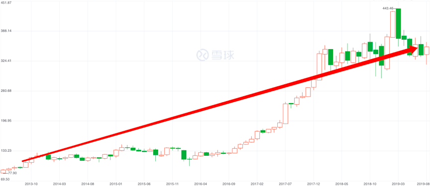

# 三好选股法

Hello，蜜豆们好~

上一节，我们讲到了波特五力模型当中的“第一力”：
**购买者的议价能力**

判断一家公司，作为购买者是否具有议价能力，最重要的有两点：

- 上游供应商是否为分散的小公司
- 上游供应商的产品是否没有差别

如果回答是YES，那么这家公司的购买者议价能力可能就很强，是一个好公司的苗子。

最后，师兄留了一道思考题给大家，不少蜜豆也都认真完成了。这里也顺道简单的说一下我的看法：

像格力电器、美的集团这样“白色家电”行业的公司，它们的原材料主要是制造家电所需要的“铜材、钢材、铝材和塑料”。

这些原材料，都属于“大宗商品”，彼此之间没有差异。
出售这些原材料的厂商非常多，在市场上也可以很轻易的买到。

所以，格力电器、美的集团等白色家电的龙头公司，作为购买者的议价能力是比较强的。

好，既然在买原材料的时候，我们喜欢上游都是一些虾兵蟹将，能够让我们“客大欺主” 的公司。

那在出售产品的时候，我们就喜欢下游是一些虾兵蟹将，让我们可以“店大欺客”的公司了。

这就要说到波特五力模型当中，另一个重要的标准了：

**供应商的议价能力。**

一家公司买下原材料之后，自然就是要把原材料进行加工，然后卖给下游的厂家了，也就是作为“供应商”。

供应商的议价能力越强的公司，卖出去的东西就可以越贵，而且客户也会越来越离不开它。

供应商的议价能力到底有多重要？
怎么判断一家公司，作为供应商是否具有议价能力呢？

让我们一起进入今天的正篇内容吧。

---

所谓供应商的议价能力。
简单的说，就是它的下游敢不敢杀它的价。

供应商议价能力强的公司，对下游的话语权就强。
也就是我们经常说的：店大欺客。

上一节当中，我们曾经提到过航空业。
航空公司作为购买者，议价能力是很差的。

那反过来，它的上游“飞机制造商”的供应商议价能力就很强。

因为比较大的飞机制造商，就只有“空客”和“波音”。
航空公司没有选择，只能乖乖的选择高价购买飞机。

这一点，通过上一节内容的学习，相信大部分蜜豆都比较清楚了：

如果一家公司，它下游是比较分散的，而自己在行业内是龙头垄断的，那么它的供应商议价能力就比较强。

除此之外，还有另一个很重要的点：
如果一家公司对于下游来说，“转换成本”很高，那么它作为供应商的议价能力，也会很强。

所谓“转换成本”，就是说下游客户从原来的产品，切换到新的产品上，所需要付出的成本。

比如，“东方航空”本来买的是空客的飞机。
现在高管们都觉得空客的飞机不好，建议老板换成波音的。

东方航空老板：
What are you 弄啥嘞？

我可是花了上千亿才买下这些飞机的，现在你要我全毁了，再花上千亿买一波新的？

什么？不用毁？卖了？
这几百架飞了十几二十年的老旧飞机，我卖给谁去呀，哪有人要我的这些娃儿呀。

哦对了，我们养的这帮工程师都只学了“空客”飞机的维修技术，我还得再送他们去美国培训“波音”飞机的维修技术……

哎，我们还是老老实实的，用“空客”的飞机吧。

就这样，东方航空基本就被上游牢牢控制住了。
最重要的原因，就是“转换成本”太高，它几乎不可能把自家的飞机，换成另一家公司生产的。

因此，飞机制造商“波音”和“空客”，作为供应商的议价能力就很强。

---

看完了正面的栗子，我们再来看一个反面的栗子：
电子配件及元件行业

比较出名的，就是“德赛电池”了，它的主营业务是制造、生产和售卖锂电池的。

生产电池，看起来还是比较高科技的，应该有差异化。
但事实上德赛电池作为供应商的议价能力，是很弱的。

为什么呢？
我们还是从刚才说到的两个点来看。

首先是上下游地位。

德赛电池作为供应商，它的客户都是谁呢？
答案是：苹果、华为、OPPO等手机厂商。

德赛电池在2018年的年报中明说了：
公司的前五大客户收入，占总收入的80.98%。
它的下游客户，是高度集中，并且都是赫赫有名的大公司。

这些厂家可都是大佬。
德赛电池虽然也算电池界的佼佼者，但也只得给这些大佬端茶倒水。

苹果、华为CEO：
不就是块电池吗？
又不是就你德赛能做。

其次，就是“转换成本”。

电池本身作为一种消耗品，本身就是需要更新迭代的。
而且，不同厂家生产的电池，在兼容性方面并没有太大的区别。其它厂商生产的电池，也可以在苹果、华为的手机上用。

所以，对于德赛电池的下游客户来说，转换成本是不高的。
只要稍不满意，苹果、华为这些大佬，就可能会采用别的厂商生产的电池。

结合以上两点：
德赛电池作为供应商，它的议价能力会比较弱。

---

供应商议价能力的差距，最终也会反应到股价上。
（见图1、图2，波音公司和德赛电池近5年的股价走势）

图1

图2

到这里，我们总结一下今天的重点。

波特五力模型的“第二力”叫做：**供应商的议价能力**。
它也是甄别好公司的标准之一。

判断一家公司，作为供应商是否具有议价能力，最重要的是看两点：

- 下游客户是否为分散的小公司
- 对于下游客户来说，自家的产品是否具有高“转换成本”

如果以上两个问题的回答是YES，那么这家公司作为供应商，就很可能具有很强的议价能力，也是我们需要寻找的好公司。

最后，跟判断一家公司“购买者议价能力”的强弱一样。
最最重要的，你得先了解这家公司的下游到底是谁，它的产品是不是具有很高的“转换成本”。

今天的小作业：
“供应商议价能力”的强弱，你会判断了吗？

根据今天所学的知识，你觉得医药行业中，“华东医药”作为供应商的议价能力如何呢？为什么？

记得在评论区交作业哟

