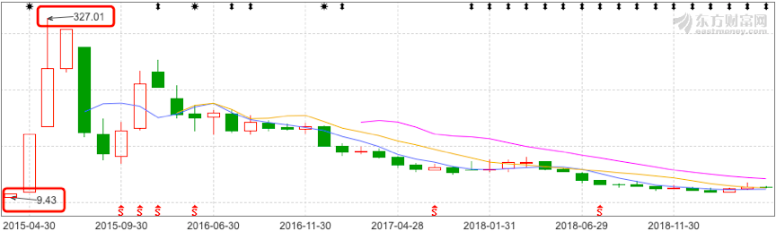
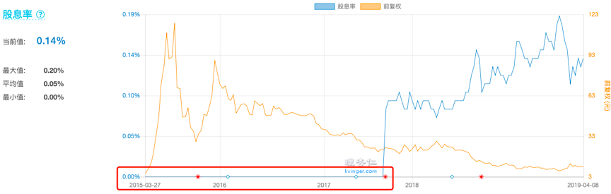

<!--
 * @Author: XueBaBa
 * @Description: 文件描述~
 * @Date: 2020-12-14 17:17:11
 * @LastEditTime: 2020-12-14 17:39:01
 * @LastEditors: Do not edit
 * @FilePath: /books/pages/9-股票分类/混沌股.md
-->
 

今天，我们来讲股票家庭中的最后一位成员。

他，长着一张大众脸。
五官端正，却笑里藏刀，坑害了很多小白股民。
他，就是混沌股。

哎，这个“馄饨（tun）”，不是“混沌（dun）”。

混沌股，是长这样的：

 
没错，“混沌股”是像乌云一般的存在。

它的背后是金光灿灿的太阳。
但随之而来的，也可能是一场狂风暴雨。

---

2015年3月，正值牛市火热的阶段。有一家做视频播放器的公司，乘着牛市的春风火爆上市。

它的股票在上市后被爆炒，股价一路从发行价7.14元，涨到了300多元，PE高达1396倍。
但随后却一路暴跌，如今它的股价只有10块钱。（见图3）

从我们价值投资的角度来看，这家公司既无法判断未来的盈利状况，也没有历史数据可供参考。最关键的是，它还不分红。（见图4）

虽然从我们的角度看，它完全没有投资价值。
但，如果你在它刚上市的时候冲进去，又能在两个月后及时撤出，还真的可以赚到很多钱。

这家股价暴涨暴跌的公司，就是“暴风集团”。

而这类没办法用价值投资的方法，判断其投资价值的股票，我们就称之为“混沌股”。

“混沌股”的乌云背后，有可能是金光灿灿的太阳，但也必然伴随着一场猛烈的暴风雨。

“混沌股”是投机者和赌徒的主战场，它是我们做价值投资的小白，需要极力避开的。

---

师兄，我知道需要避开“混沌股”了，那么怎么识别出它呢？
这里，皮妈给大家总结了4个标准，帮助大家轻松识别典型的“混沌股”。

下面，我们就一条一条来说：

**1.上市不满3年的股票**

我们分析公司，都是要看历史数据的。
比如，看PE,PB温度，对比利润增速这些。

所以，对于上市不满3年的公司，它的历史数据非常少，对于我们来说，就像“乌云”一样。

因此这些股票，可以归为混沌股，直接剔除。

**2.连续3年不分红的股票**

正常来说，公司赚了钱，当然是要拿出一部分来孝敬我们股东的嘛。

如果公司连续3年都没有分红了。一般有两种情况：

1）公司的高管骗我们说现在公司经营需要很多钱，没钱分给我们，但自己偷偷拿钱去改善生活。
2）公司是真的没钱，揭不开锅。

无论是哪种情况，对我们来说都不是一个好消息。
而且，实际上我们也很难去搞清楚具体的情况，就像“乌云”一样。

所以这种公司，我们也直接PASS。

**3.ROE连续3年低于5%的股票**

ROE，蜜豆们都知道是表示公司盈利水平的指标嘛。
如果连续3年ROE都低于5%，说明这家公司真的是个弱鸡，没什么投资价值。

因此，这种公司如果出现了大涨，更可能是因为一些其它方面的原因，比如政策利好，板块炒作等等。
而这些因素对我们小白来说，就像“乌云”一样，是很难琢磨清楚的。

所以，ROE连续3年低于5%的股票，我们也列为混沌股，直接放弃。

**4.流通股小于1亿股的股票**

这个条件，大部分蜜豆可能比较陌生。
什么是“流通股”呢？

讲“流通股本”之前，我们先要了解一下“总股本”的概念。

“总股本”就是说，这家公司一共发行了多少股。
总股本和股价的乘积，就是公司的市值。

比如铁柱股份，一共发行了1亿股，股价是10元/股，那它的市值就是10亿元。这个应该很好理解。

但有的时候，上市公司的股票，有一部分是不卖的。
比如铁柱股份的1亿股里面，只有5000万的股票，是可以给大家交易的；而剩下的5000万股票，铁柱自己拿在手里，不卖。

那么，铁柱不卖的那5000万的股票，就叫做“限售股”。
而可以给大家买卖的另外5000万股票，就叫做“流通股”。
我们在市面上可以交易的股票，都是流通股。

重点来了，为什么我们要剔除流通股<1亿的股票呢？
一般来说，流通股<1亿，代表这家公司的规模不大，市值也很小，被称为“小盘股”。
这类公司，是很容易受到别人“操控”的。

之前我写过一篇文章，告诉大家那些荐股群的操作手法，其中利用的就是这些“小盘股”。他们只需要花几百万，就可以轻松的让当天的股价大涨。

所以说，这类公司的涨跌，也是像“乌云”一样，让我们摸不清楚的，直接放弃就可以了。

---

好，以上就是我们识别“混沌股”的4条基本指标，满足其中一条，基本就可以定义为“混沌股”，我们直接放弃就可以了，不用浪费时间研究它们。

但还是那句话：
任何指标，都是我们投资的辅助工具，它不是万能的。
但用好这些小技巧，可以更好的保护我们自己。

避开那些我们看不懂的而且很容易亏损的“混沌股”，其实就已经一只脚踏进了财富自由的大门。