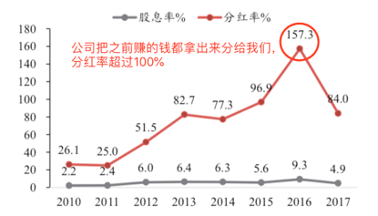
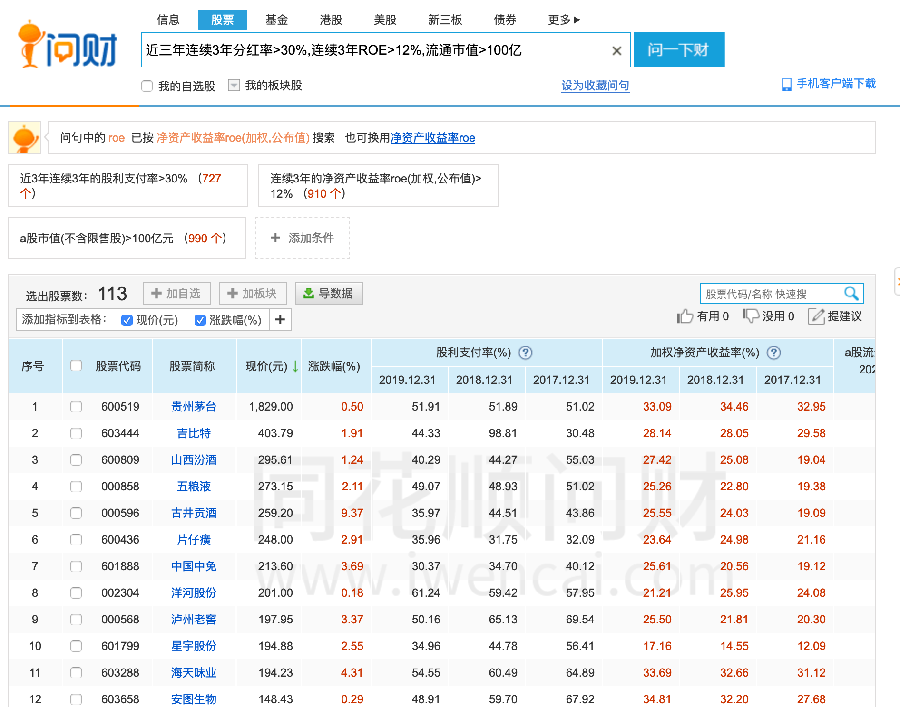

<!--
 * @Author: XueBaBa
 * @Description: 文件描述~
 * @Date: 2020-12-14 15:49:18
 * @LastEditTime: 2020-12-14 16:48:41
 * @LastEditors: Do not edit
 * @FilePath: /books/pages/9-股票分类/蓝筹股.md
-->

# 蓝筹股

今天要给大家介绍的是，
一位大家可能听过，但不太熟悉的股票成员。

他，在妹子们的心中是一位稳重的大叔，值得终身托付。
但随着时代的变化，小鲜肉越来越招妹子们的喜爱，而稳重的大叔却越来越没有人气。

这位大叔的名字，就叫做“蓝筹股”，简称“蓝叔”。

---

说起火腿肠，大家肯定都吃过。

做火腿肠，其实没什么大不了的。
只要有猪肉，有生产的设备，就可以开始做了。
市面上也有好几家大型公司在做火腿肠。

但这家公司，跟其他公司相比，有一个很大的不同点。
别的公司，每年赚来的钱，绝大部分都会用来继续扩张，支援公司的发展建设。

但它，每年都把赚到的绝大部分钱，发放给我们股东。

甚至有的时候，它不仅发给我们当年赚到的所有的钱。
就连几年赚到的钱，都从存款里拿来发给我们。

这么慷慨的公司哪里找？！
哎，不得不说，人间有真情。

这位慷慨又稳重的大叔，就是“双汇发展”。
它也是“蓝筹股”大叔的代表。

---

好，那怎么勾搭这么稳重又慷慨的蓝叔呢？
别着急，我们要先学会从茫茫人海中找到他。

蓝叔，典型的特征就是慷慨的高分红，以及稳重的形象。

**那反应在指标上，就有三个特征：**
1)	连续3年分红率>30%
2)	连续3年ROE>12%
3)	流通市值>100亿

简单解释下：
所谓分红率，就是指公司一年到头赚的钱，有多少是分给我们股东的。
这个指标，注意不要跟股息率搞混了。

ROE这个蜜豆们都比较熟悉了，它是反应一家公司盈利能力的指标，这里的标准比白马股要略低一些。

流通市值，主要是用来判断一家公司的规模是不是够大。
也是判断蓝叔够不够稳重的重要指标之一。

好，我们在i问财上，用这三个指标来筛选一下（见图3）。

今天（2020.12.14）筛选的话，能选出113家符合条件的公司。

可以看到，像“贵州茅台”、“海天味业”、“双汇发展”这些耳熟能详的公司，他们都是典型的蓝叔。

---

重点来了，筛选出来了之后，是不是就可以直接上车了？

当然不是。
蓝叔虽好，但也不可贪杯。

首先，我们可以从中精挑细选。
比如，如果其中一位蓝叔，他的分红率连续3年都超过了50%；或者连续5年都超过了30%，那就可以重点关注。

然后，我们要在比较便宜的时候上车。
具体一点，就是PE,PB分位点都在30%以下。
这一点，跟上白马股王子是类似的。

那，上了车之后，什么时候该下车呢？
下车的姿势，主要有三种：
1)	蓝叔不再慷慨，也就是分红消失或者大大减少的时候，就要格外注意。（比如分红率本来有50%，突然变成了只有20%，甚至不分红了）
2)	蓝叔不够稳重了，ROE不符合标准了。
3)	蓝叔太贵了，约不起了。PE,PB分位点其中有一个超过了80%就要注意。

---

关于蓝叔的姿势，到这里就接近尾声啦。

聪明的蜜豆会发现，蓝叔和白马王子，有很多类似之处。
有些公司，既是蓝叔，也是白马王子。

对的，蓝叔和白马王子的形象很接近。
但不同的是，蓝叔更加稳重和慷慨，更体贴和照顾我们小股东。

在大盘下跌的时候，大部分蓝叔跌的较少。
但同样的，大盘涨的时候，他们涨的可能也不会太凶。

所以，在人人都抛弃他们的时候，才是我们最好的上车机会。

蓝叔的姿势，你都学会了吗？
欢迎留言讨论哟！

风险提示：文中提及的公司，仅作为案例分析，不构成投资建议。